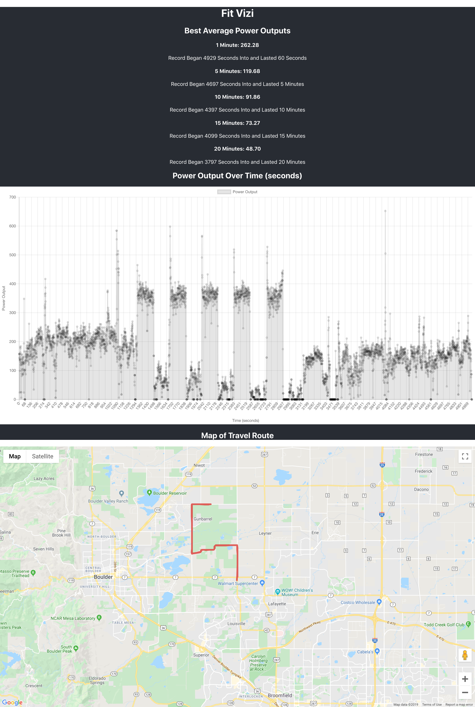
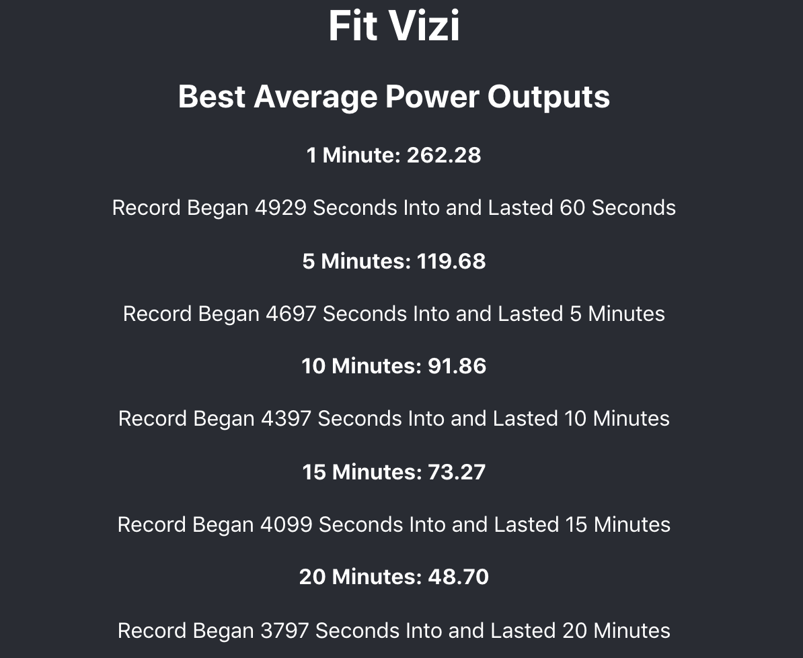
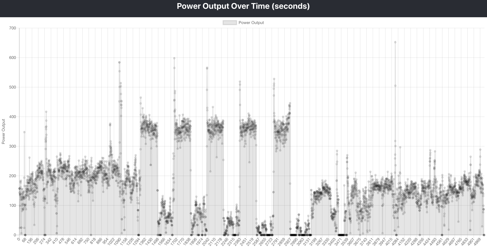
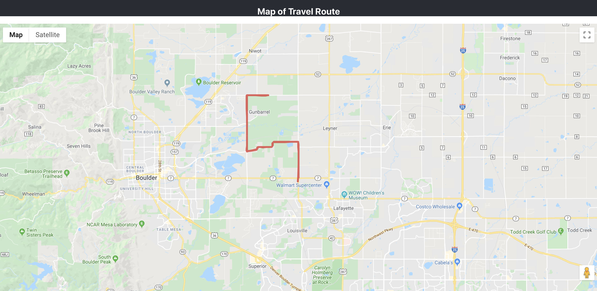

# Fit Vizi: Fitness Visualizer

## Description

Fit Vizi, a single page web application built in React, is a fitness visualizer that fetches workout data from a backend API built with Express.js and deployed to [Heroku](https://be-fit-vizi.herokuapp.com/). 

The visualizer displays:
  - The 'best' (defined as highest continuous average for the given time period) periods of the workout 
  - A graph of the workout's power output over time and 
  - A path map of the latitude and longitude of the workout data using Google Maps API

## Technologies Used:
* React
* Fetch API
* Asynchronous JavaScript
* Express.js
* Jest 
* Enzyme

## Objectives:
* Display the GPS path on a Map
* Display the power output over time on a graph, using time as the X axis
* When user selects a range of time on the graph, highlight the corresponding range on the map
* Display the 1, 5, 10, 15, and 20 minute "best" efforts
* Write the most efficient method that finds the "best" 20 minute power effort
  - "Best" is defined as highest continuous average for the given time period.
* Implement asychronous testing and Enzyme/Jest UI testing

## Installation

Clone down the UI repository and cd into it.

Install the application's dependencies from within the cloned directory:
```bash
npm install
```

Then launch the application within the browser:
```bash
npm start
```

## Testing 

The application comes with a testing suite, to view run `npm test` from within the CLI.

This command will launch the test runner in the interactive watch mode.


## Screenshots

Homepage



'Best' Display



Graph Display



Map Display




## Developer

[Alyssa Lundgren](https://github.com/lundgrea)
